# Проект базы данных "Mostov Car-Service"
Это учебный проект базы данных для автосервиса.
Сделаны таблицы, представления, процедуры, триггеры, интерфейс с режимами пользователя и администратора, плюс всякие сложные запросы.
Всё, чтобы научится работать с PostgreSQL.

- Структура базы данных - [backup.backup](./Backup%20bd/backup.backup)

**Запуск сервера:**
```bash
pg_ctl start -D "C:\Program Files\PostgreSQL\17\data" # ну или ваш путь
```

## Задание 1-2: Реляционная модель

На первом этапе была выбрана предметная область — **автосервис**. Проведён анализ сущностей и их связей, после чего построена реляционная модель данных.

### Требования к модели:
- Не менее **6 родительских** таблиц (справочников).
- Не менее **10 дочерних** таблиц (связанных с родительскими).
- Минимум **3 уровня иерархии** — отношения, связанные через два уровня.
- Максимум **количественных и измеримых характеристик** в таблицах (дата, стоимость, количество, длительность и т.д.).
- Использована нотация **"Воронья лапка"** для визуализации связей между таблицами.


<div style="text-align: center;">
  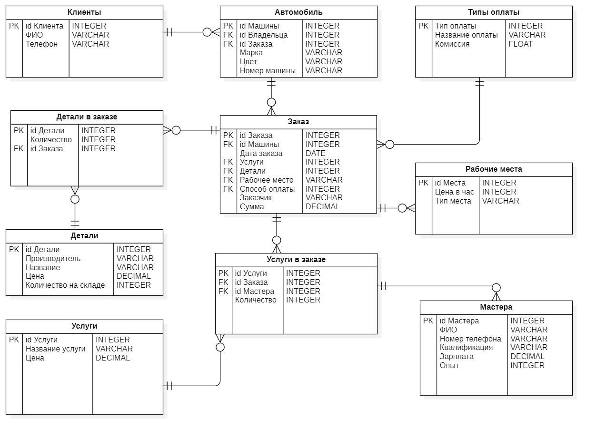
</div>

<div style="text-align: center;">
  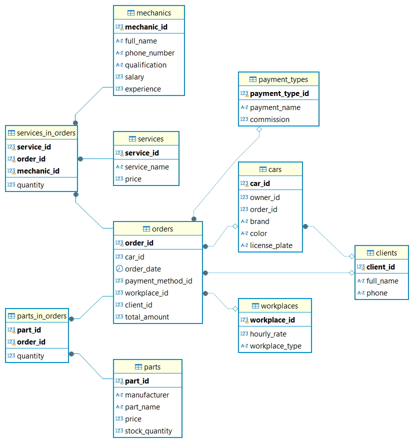
</div>

## Задание 3: Простые SQL-запросы
[🔗 3) Task, Простые запросы.sql](./Tasks/3%29%20Task,%20Простые%20запросы.sql)

## Задание 4: Построение и тестирование индексов
- Индексы следующих типов:
  - **Простой** (B-Tree, Hash)
  - **Уникальный** (B-Tree)
  - **Составной** (B-Tree)
  - **Индексы с выражениями**
  - **Покрывающий индекс** (B-Tree)
  - **Частичный индекс**
  - **Частичный покрывающий индекс** (B-Tree)
  - Оптимизации **JOIN**-ов и **LIKE**-запросов

📄 [4) Задание 4, Индексы.docx](./Tasks/4%29%20Задание%204,%20Индексы.docx)

## Задание 5: Представления

- Созданы не менее 3-х представлений на основе отчётов по предметной области.
- Реализованы автоматически изменяемые представления с `WITH CHECK OPTION` (`LOCAL`, `CASCADED`).

📄 [5) Задание 5, Представление.sql](./Tasks/5%29%20Задание%205,%20Представление.sql)

## Задание 6: Использование триггеров

- Реализованы триггеры:
  - `BEFORE` и `AFTER` для `INSERT`, `UPDATE`, `DELETE` (построчные и операторные).
  - `INSTEAD OF` триггеры для обновляемого представления, основанного на нескольких таблицах.
  - `INSTEAD OF` триггер для каскадного изменения данных.

📄 [6) triggers.sql](./Tasks/6%29%20triggers.sql)

## Задание 7: Разработка хранимых процедур и функций

- Реализовано:
  - **3 функции** (SQL и PL/pgSQL), включая:
    - Возврат базовых типов
    - Возврат множеств (`SETOF`)
    - Возврат таблиц (`TABLE`)
  - **2 хранимые процедуры** с управлением транзакциями

    
📄 [7) function.sql](./Tasks/7%29%20function.sql)


## Задание 10: Создание сложных запросов к базе данных

- Использование автономных подзапросов.
- Коррелированные подзапросы в `SELECT` и `WHERE`.
- Работа с временными таблицами.
- Использование оконных функций с `OVER (PARTITION BY...)`:  
  `ROW_NUMBER()`, `RANK()`, `DENSE_RANK()`, `CUME_DIST()`, `NTILE()`, `LAG()`, `LEAD()`, `FIRST_VALUE()`, `LAST_VALUE()`, `NTH_VALUE()`.
- Применение общих табличных выражений (CTE) с `WITH`.
- Слияние данных с помощью `MERGE` (INSERT, UPDATE).
- Использование функции `CROSSTAB` для сводных таблиц (PIVOT).
- Трансформация столбцов в строки с `UNNEST` и `ARRAY` или `CROSS JOIN LATERAL`.
- Группировка с `GROUP BY` и операторами `ROLLUP`, `CUBE`, `GROUPING SETS` (с использованием функции `GROUPING`).
- Секционирование данных с `LIMIT`, `OFFSET`, `FETCH`.
- Управление транзакциями: `BEGIN`, `COMMIT`, `ROLLBACK`, `SAVEPOINT`.
- Обработка ошибок и сообщений с `RAISE`, блоками `EXCEPTION`.
- Использование диагностических функций `GET STACKED DIAGNOSTICS` и `GET [CURRENT] DIAGNOSTICS` для передачи сообщений об ошибках клиенту.

📄 [10) Task10, Сложные запросы.sql](./Tasks/10%29%20Task10,%20Сложные%20запросы.sql)


## Задание 8: Разработка интерфейса пользователя

- **2 Режима доступа**:
  - Администратор: полный доступ
  - Пользователь: ограниченный доступ

- **Формы**:
  - Ввода данных для всех справочников (для администратора)
  - Просмотра данных с фильтрацией по режиму пользователя
  - Сложная форма: просмотр записей "один ко многим"

- **Дополнительная функциональность**:
  - Кнопки генерации отчетов (используются процедуры из Задания 7)
  - Ввод данных через представления (из Задания 6)
  - Поисковая форма с соединением таблиц
  - Использование процедур и функций из Задания 7


### Пользовательский режим:
#### Главное окно
<div style="text-align: center;">
  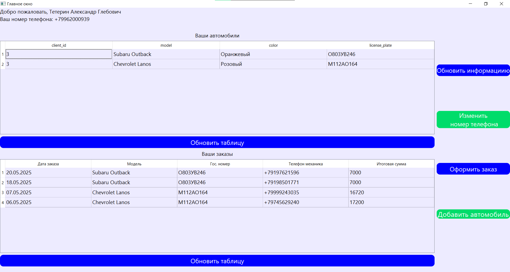
</div>

#### Добавление автомобиля 
<div style="text-align: center;">
  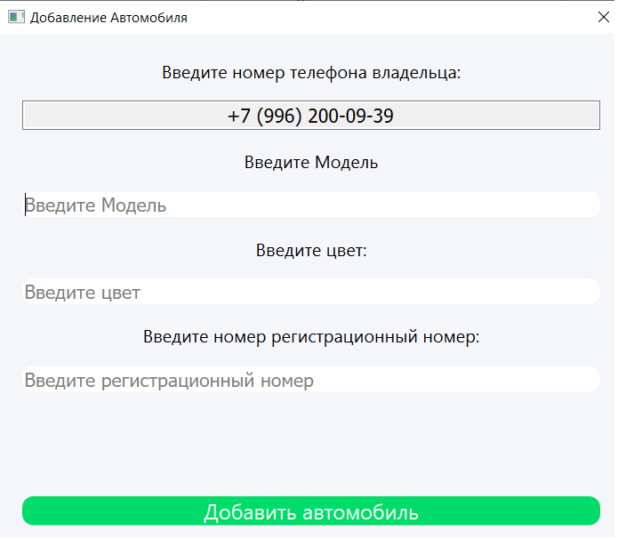
</div>

#### Добавление заказа(Общее, похожее)
<div style="text-align: center;">
  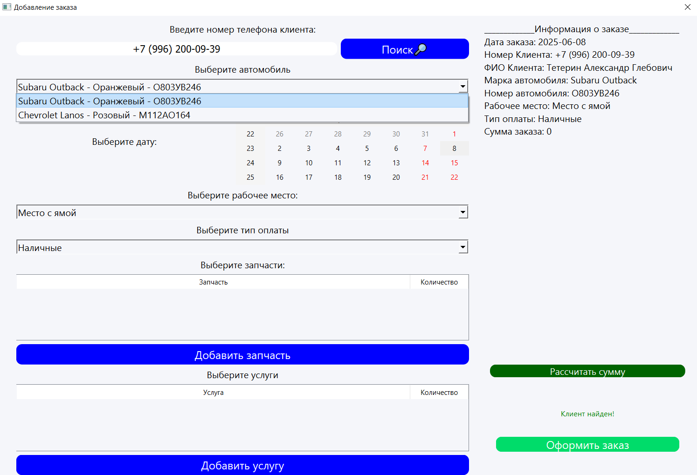
</div>

<div style="text-align: center;">
  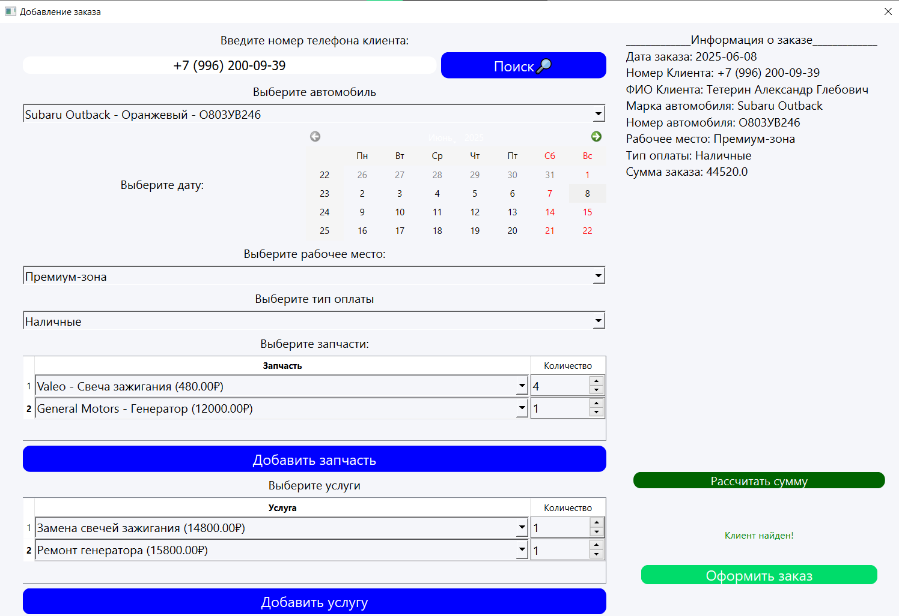
</div>

### Режим администратора:
#### Главное окно
<div style="text-align: center;">
  
</div>

#### Вкладки
<div style="text-align: center;">
  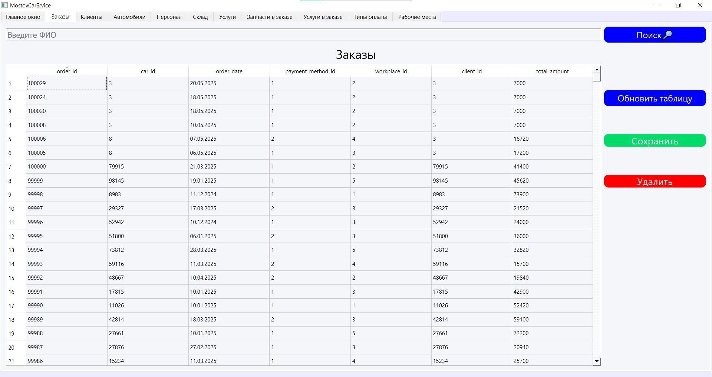
</div>

<div style="text-align: center;">
  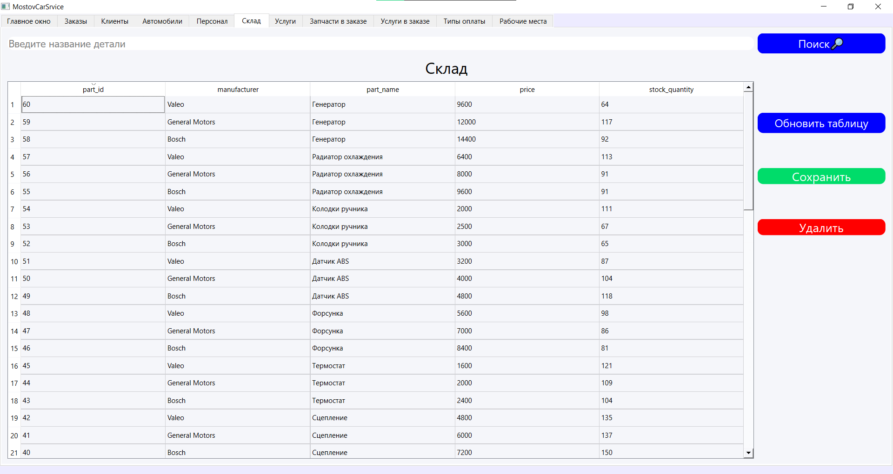
</div>

и тп

#### Отчёты
- Объединение клиентов и автомобилей(Связь один ко многим)
<div style="text-align: center;">
  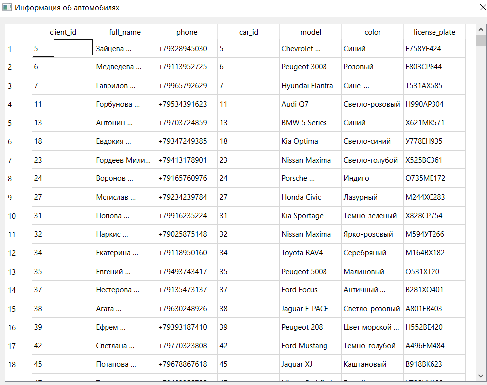
</div>

- Проданные запчасти за последний месяц(Проект разрабатывался больше месяца назад и новых заказов нет)
<div style="text-align: center;">
  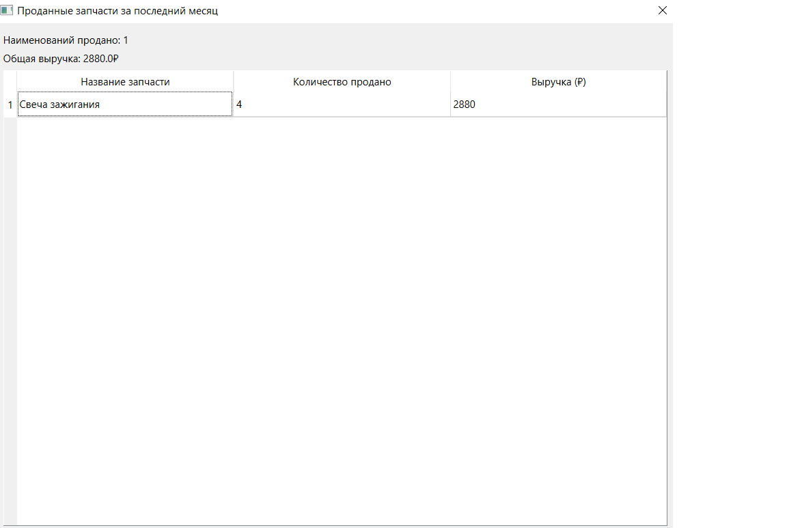
</div>

- Популярные услуги
<div style="text-align: center;">
  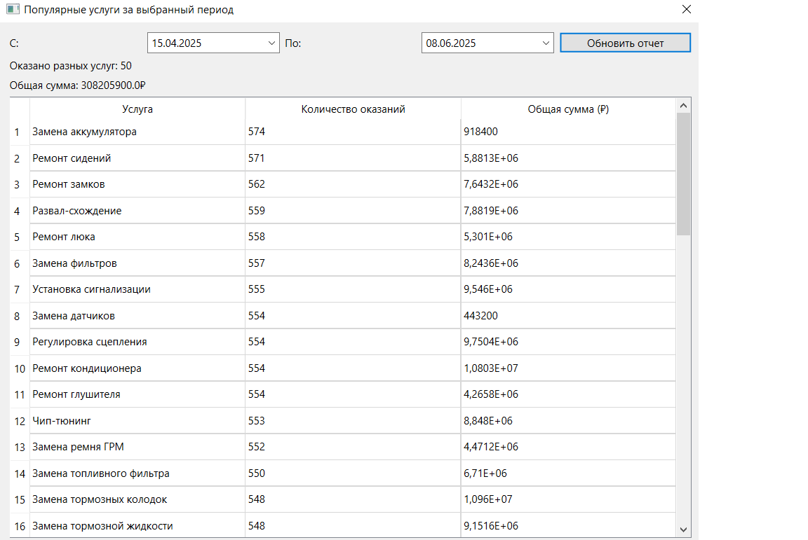
</div>


 Количество вкладок и вариантов поведения при ошибках достаточно велико,
 поэтому здесь приведены только основные окна